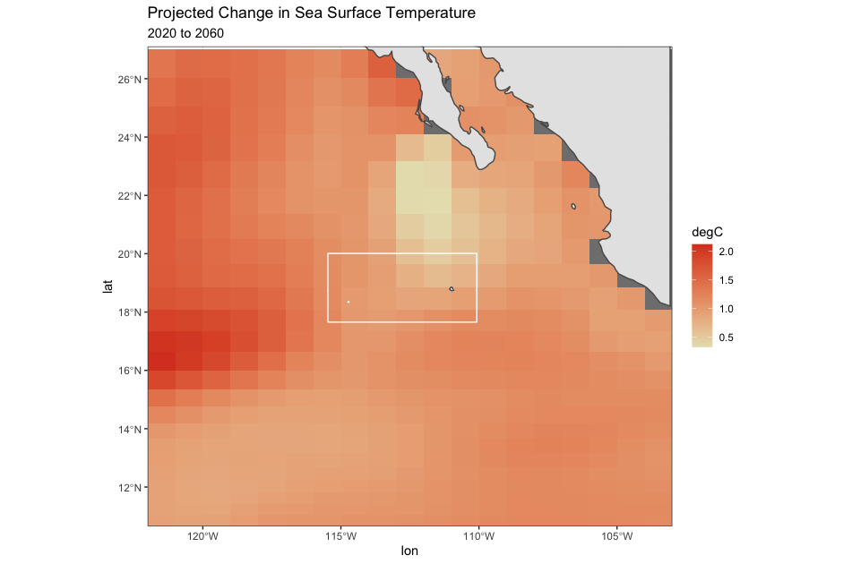
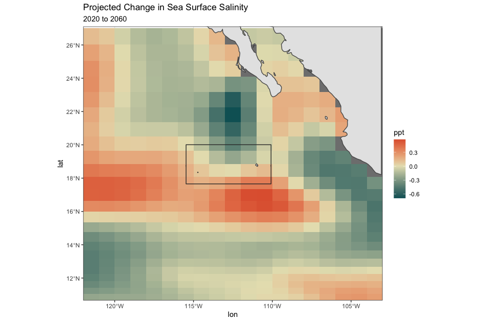
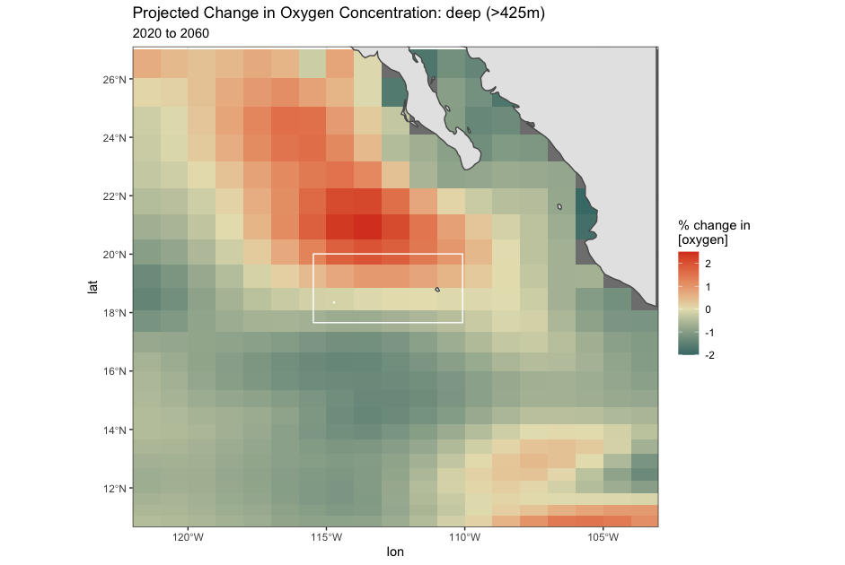
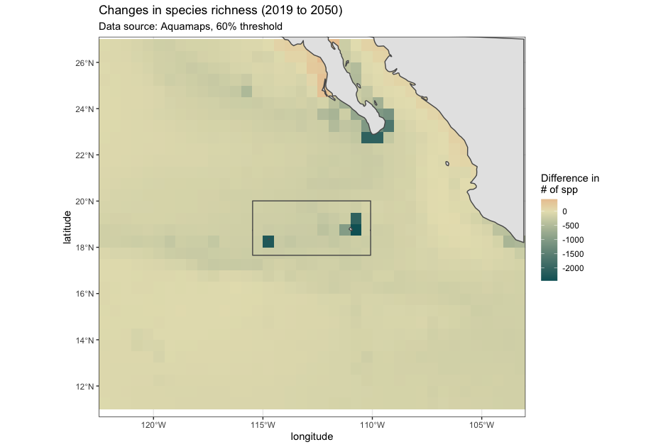
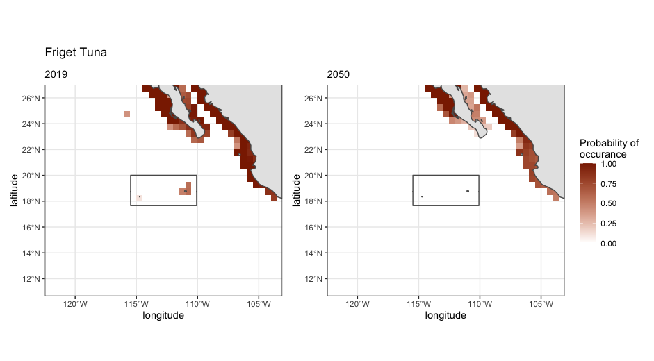
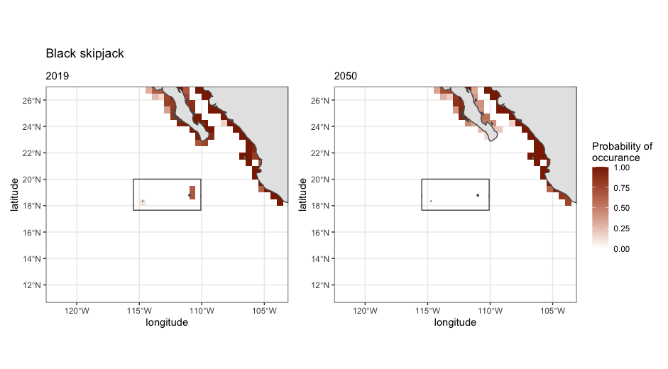
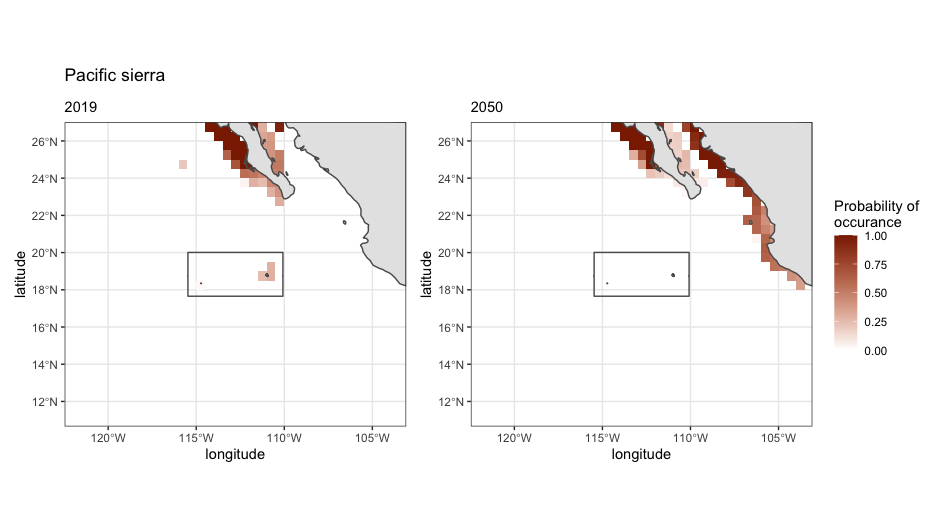

```{r setup, include=FALSE}

knitr::opts_chunk$set(echo = TRUE,warning = FALSE,message = FALSE)

library(tidyverse)
library(kableExtra)
library(here)

source(file.path('..',"sourceCode","calcSource.R"))

```

The Revillagigedo MPA protects the Revillagigedo Archipelago which is made up of 4 islands over 500 km from mainland Mexico (Cabo San Lucas). The MPA protects the convergence of 2 ocean currents which make this an important site for several species, including 26 species of endemic fish, and acts as a wintering and calving area for humpback whales. Included here are ensambled CMIP6 data that projects chages in sea surface temperature, surface salinity, and oxygen concentration to 2060. Additionally, changes to species distributions are projected as total changes in the number of species in an area, as well as changes to specific targeted species: tunas and mackerels.

```{r warning=FALSE, message=FALSE}

revShp<-st_read("WDPA_WDOECM_Mar2022_Public_555629385_shp/WDPA_WDOECM_Mar2022_Public_555629385_shp_0/WDPA_WDOECM_Mar2022_Public_555629385_shp-polygons.shp",quiet=TRUE)

revExt<-extMapFunc(revShp,buff=7,zoomLat=20,zoomLon=25,corr=NA)

revExt

```

***

### CMIP6 Climate projections

Below we look at how sea surface temperature and salinity will change by 2060 and how oxygen levels are predicted to change in shallow systems and at depth around the Revillagigedo MPA. We are still preparing data to assess how temperatures might change throughout the water column and will add those to these analyses when they are ready. 



***



***




***

### Species distribution data

###### *Data source: Aquamaps*

Aquamaps calculates species distributions for over 33,500 species of fish, marine mammals, and invertebrates based on available data of the environmental envelope of each species, which includes preferences for depth, water temperature, salinity, primary productivity, dissolved oxygen, and association with sea ice or coastal areas. The species are then mapped to locations where the conditions that fit these envelopes. Some species have additionally been through expert review to adjust for additional parameters but this work is ongoing. 



#### Species losses/gains to the MPA

```{r}
revSpp2019=3741
revSpp2050=1576

revLosses=2179
revGains=14

```

Species count 2019 = **`r revSpp2019`**  
Species count 2050 = **`r revSpp2050`**

* Losses &darr; = `r revLosses`
  * Mammals: Eden's whale, common dolphin, Sei whale
  * Sport fish: Wahoo, Pompano (dolphinfish), pomfret
  * Sharks: Bigeye sand tiger shark, megamouth shark
  * Invertebrates: 
  * Deepsea species: various lanternfish

* Gaines &uarr; = `r revGains`
  * Brownsnout spookfish
  * Constellationfish
  * Pearly lanternfish


*** 

#### Economically relevant species

Quick look at fishing in the area on the [Global Fishing Water data portal](https://globalfishingwatch.org/map/fishing-activity/udw-revillagigedo_mpa-public?latitude=17.32905138377592&longitude=-111.75727212017733&zoom=5.398953867584273&start=2021-06-13T00%3A00%3A00.000Z&end=2022-06-13T00%3A00%3A00.000Z&bivariateDataviews[0]=fishing-ais&bivariateDataviews[1]=vms&dvIn[0][id]=highlight-sar-match&dvIn[0][cfg][vis]=false&dvIn[1][id]=viirs&dvIn[1][cfg][vis]=false&dvIn[2][id]=presence&dvIn[2][cfg][vis]=false) shows that *tuna purse seining* is the main fishing gear in the area. This gear target tuna and mackerel species, which fall into one of the following genus':

```{r, warning=FALSE,message=FALSE}

tunMacs<-data.frame(fish=c(rep("tuna",6),rep("mackerel",5)),
                    genus=c("Thunnus","Neothunnus","Allothunnus","Auxis","Euthynnus","Katsuwonus","Rastrelliger","Scomber","Acanthocybium","Grammatorcynus","Scomberomorus"))

kable(tunMacs)%>%
  kable_styling()

```

```{r}

# fishedChg<-revSpShifts%>%
#   filter(Genus %in% tunMacs$genus)

fishedChg<-read_csv("outputs/revSpShft_tunas.csv")

kable(fishedChg)%>%
  kable_styling()

```

#### What's going to happen to these tuna fisheries?







