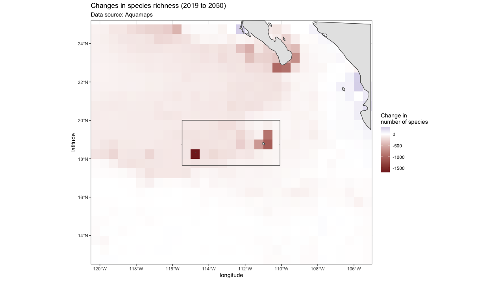

```{r setup, include=FALSE}
knitr::opts_chunk$set(echo = TRUE)
```

The Revillagigedo MPA protects the Revillagigedo Archipelago which is made up of 4 islands ober 500 km from mainland Mexico (Cabo San Lucas). The MPA protects the convergence of 2 ocean currents which make this an important site for several species, including 26 species of endemic fish, and acts as a wintering and calving area for humpback whales. Here ensambled CMIP6 projection data was be used to plot ocean temperatures into the future at several depths around the Revillagigedo MPA in the eastern Pacific Ocean. 

## Epipelagic

```{r, echo=FALSE,out.width="33%",out.height="20%",fig.cap="Temperature in degrees Celcius",fig.show='hold',fig.align='center'}

# knitr::include_graphics(c("gifs/potTempEpi2015RevMx.gif","gifs/potTempEpi2050RevMx.gif","gifs/potTempEpi2100RevMx.gif"))

knitr::include_graphics(c("gifs/potTempEpi2015RevMx.gif","gifs/potTempEpi2100RevMx.gif"))
``` 

***

## Mesopelagic

```{r, echo=FALSE,out.width="33%",out.height="20%",fig.cap="Temperature in degrees Celcius",fig.show='hold',fig.align='center'}

# knitr::include_graphics(c("gifs/potTempMso2015RevMx.gif","gifs/potTempMso2050RevMx.gif","gifs/potTempMso2100RevMx.gif"))

knitr::include_graphics(c("gifs/potTempMso2015RevMx.gif","gifs/potTempMso2100RevMx.gif"))
``` 

***

## Bathypelagic

```{r, echo=FALSE,out.width="33%",out.height="20%",fig.cap="Temperature in degrees Celcius",fig.show='hold',fig.align='center'}

# knitr::include_graphics(c("gifs/potTempBap2015RevMx.gif","gifs/potTempBap2050RevMx.gif","gifs/potTempBap2100RevMx.gif"))
knitr::include_graphics(c("gifs/potTempBap2015RevMx.gif","gifs/potTempBap2100RevMx.gif"))

``` 

***

## Projected changes in Species Richness

