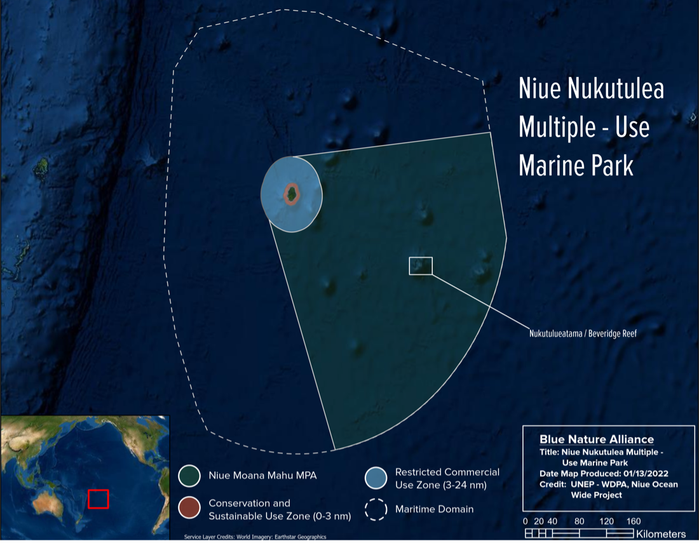
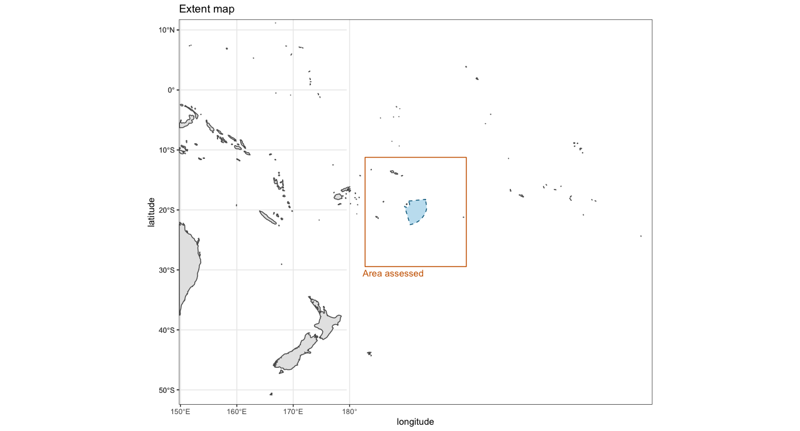
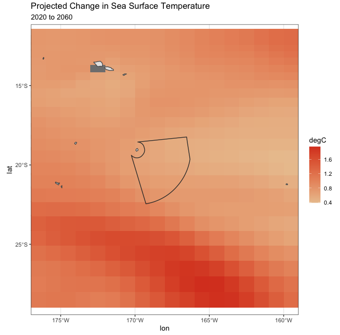
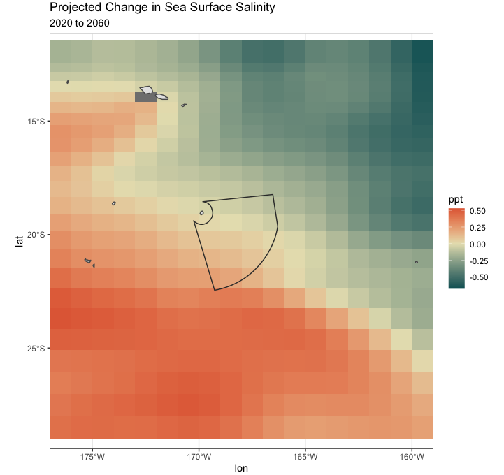
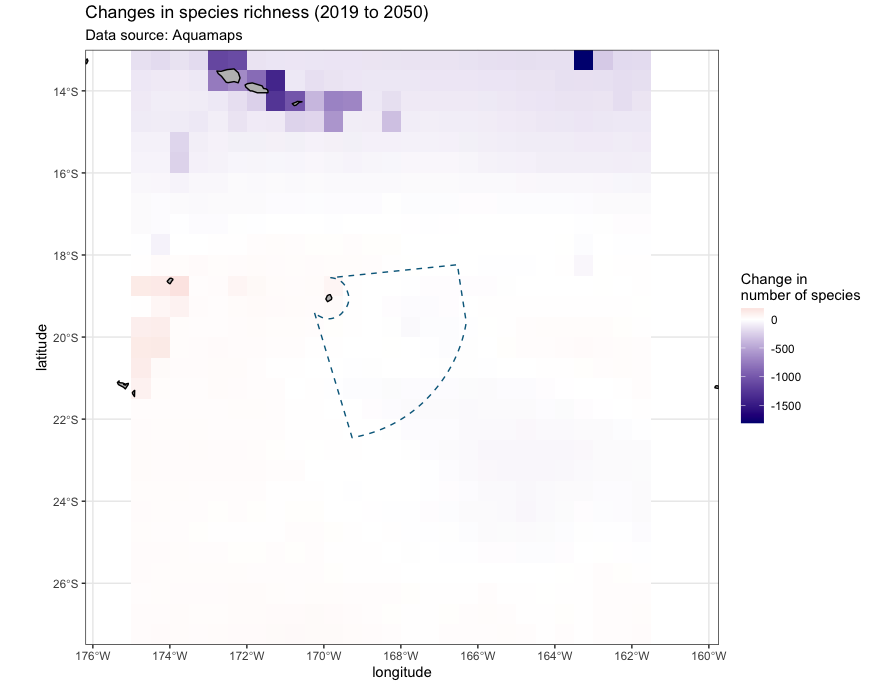

$$\\[0.25in]$$
## Moana Mahu Marine Protected Area & Nukutulueatama Beveridge Reef Special Management Area

```{r setup, include=FALSE}

knitr::opts_chunk$set(echo = FALSE,warning = FALSE,message = FALSE,fig.align = "center")

library(tidyverse)
library(kableExtra)
library(distill)

# source(file.path('..',"sourceCode","calcSource.R"))

```
::: {.floatting}

```{r out.width='45%', out.extra='style="float:right; padding:10px"'}

```

Niue is a small remote island nation in the central South Pacific. The area receives relatively low productivity, but due to its remoteness and small size, its ~2,000 inhabitants rely on local marine resources for nutrition. Marine ecosystems are also 
137,380 km2 (43% of the Niue EEZ) of ocean conservation area, including the highly protected **Moana Mahu Marine Protected Area (MPA)**, the highly protected **Nukutulueatama-Beveridge Reef Special Management Area (SMA)**, and the conservation zones within the recently designated **Niue Nukutuluea Multiple-Use Marine Park**.

:::

##### Site description  
*From the Blue Nature Alliance brief*

The total site area is modest with ~126,000km but this represents 40% of the EEZ under strict protection. Niue is small, isolated, and located in a zone of low productivity with no significant up-welling. Formed from an uplifted reef platform with deep water next to the shore, Niue does not have any lagoon to generate additional habitats and nurseries for reef species. Niue’s EEZ has close to 100 seamounts referenced and ridges that are interconnected, associated with the island and are important oceanic features for biodiversity, resources, and genes spillover as well as pinpoints for migratory species. There are at least three outlying coral reefs, which are at or near the surface (Beveridge, Antipode, and Haran). Of these, Beveridge Reef / Nukutulueatama considered as an ecological jewel of cultural important for Niuean's and Cook Islanders is located 240 km to the southeast of Niue. It is the largest outlying coral reef, and it boosts biomasses of fishes that are 7.5 times larger than in Niue and densities of grey reef sharks much greater than recorded anywhere else in the world at the time of the survey. Currently protected, Nukutuleata is a critical source of spillover for Niue’s reef. 

##### Significant species

The most iconic marine species of Niue are the **Katuali** or flat-tail sea snake (*Laticauda schistorhynchus*), which is endemic to Niue and is listed as Vulnerable as well as the **Blainville’s beaked whales** (*Mesoplodon densirostris* - Data Deficient by IUCN), a rarely seen species but known for their site-fidelity that was sighted several times at Beveridge Reef. 

***

### Model Projections

Below we have pulled data from several projections of marine conditions based on CMIP6 data. The data are focused around Niue and surrounding waters (see extent map below for specific region assessed). Data are subset from global models so results are often course but give us an idea of what conditions might look like into the future and what climate impacts to be aware of in planning and management.

{width=75%}


#### CMIP6 Climate projections

Here we look at how sea surface temperature and salinity will change by 2060 and how oxygen levels are predicted to change in shallow systems and at depth around the Niue MPA. We are still preparing data to assess how temperatures might change throughout the water column and will add those to these analyses when they are ready.  

Sea surface temperature is expected to increase throughout the region by nearly 2 degrees Celsius in some places. While expected to also experience increasing temperatures, the Niue MPA can be considered a relative climate refuge (<1^o^C)compared to surrounding waters, which which are expected to experience more drastic temperature changes. 

{width=75%}

***

The Niue MPA is also located between contrasting changes to sea surface salinity, which could result in either variable impacts throughout the area, or more likely, mild changes to the ecosystem from changes in salinity. 

{width=75%}

***

Notably, oxygen concentrations are expected to decrease in the area so extra consideration should be made for species sensitive to changes in oxygen availability. 

```{r, echo=FALSE,out.width="50%",fig.show='hold',fig.align='center'}
knitr::include_graphics(c("Niue/imgs/niueNoaaO2_shllw.png","Niue/imgs/niueNoaaO2_dp.png"))
```

***

#### Marine heatwaves

Marine heatwaves (MHWs) are periods of extreme warm sea surface temperature that persist for days to months and can extend from small local scales to up to thousands of kilometers and marine ecosystems, species and fisheries can be vulnerable to these events. We model defines a MHW event as an instance when the sea surface temperature (SST) exceeds its “local baseline”, defined as 99th percentile from the 1982–2016 period. The global plot here shows the total projected days when SST will exceed the local baseline, and tell us two main lessons: 1) that heatwaves will increase around the world, and 2) some places will experience more MHWs than others. 

We zoom in to the region around Niue below looking at *MHW duration* (how long MHWs will last), *MHW intensity* (how far above the baseline the MHW will be), *total MHW days* (how many total days will exceed the baseline).

***

#### MHW Duration

MHW duration is the mean duration of continuous marine heatwave events in a given location. In alignment wtih the SST predictions above, MHWs in the Niue MPA  are predicted to be milder than in surrounding areas, suggesting some relief from climate impacts might be found within these protections. Although less severe than other areas, the Niue MPA is expected to experience long MHWs up to 100 days long.

{width=75%}

The plot below shows how the duration of MHWs will continue into the future with faster accelerations at lower latitudes. Data points represent both observations (satellite) and model predictions (points that fall within the light blue shading).

{width=75%}

***

#### MHW Intensity

MHW intensity is the maximum SST anomaly as compared the the local baseline. MHW intensity is expected to increase across the region without much spatial variability (~2^o^C). So while average SST is not predicted to increase as much within the Niue MPA (from above), maximum intensities are expected to be similar throughout the region.

{width=75%}

Consistent with the map above, MHW intensity is expected to continue to increase at a uniform rate across the region. In the plot below data represent both observations (satellite) and model predictions (indicated by the light blue shading).


{width=75%}

***

#### Total MHW days

Total number of days that SST will exceed local baselines per year. Temperatures are predicted to be above baselines for the majority of the year across the region with MHWs lasting almost the entire year in the northern parts of the assessed area.

{width=75%}

Total MHW days will increase across the region, with a faster rate of increase at lower latitudes. Higher latitudes will increase at a moderate rate and mid-latitudes at a slower rate. Although all waters are expected to increase over local baselines.


{width=75%}

***

#### Species distributions

Changes to general species richness has been calculated for each 0.5 degree cell using data from Aquamaps and are based on environmental thresholds for each species and predicted conditions throughout the ocean. These models and distributions are currently being improved upon by our collaborators and these data will be updated when available. In the meantime the uncertainty in these data have been accounted for my applying a 50% threshold to species presence estimates. Therefore rare occurances are not well documented here. Additionally, the coarse scale, does not allow for an understanding of finer scale changes to species distributions.

Consistent with the projections above of the physical conditions within Niue waters, changes to species are predicted to be relatively mild, whereas more pronounced changes are expected in the surrounding regions. Note, significant loses are expected around American Samoa to the north.  

{width=75%}

Deeper assessments at the species or taxa level can be done to better understand how different groups will be affected by climate change both within the Niue MPA and surrounding regions.
